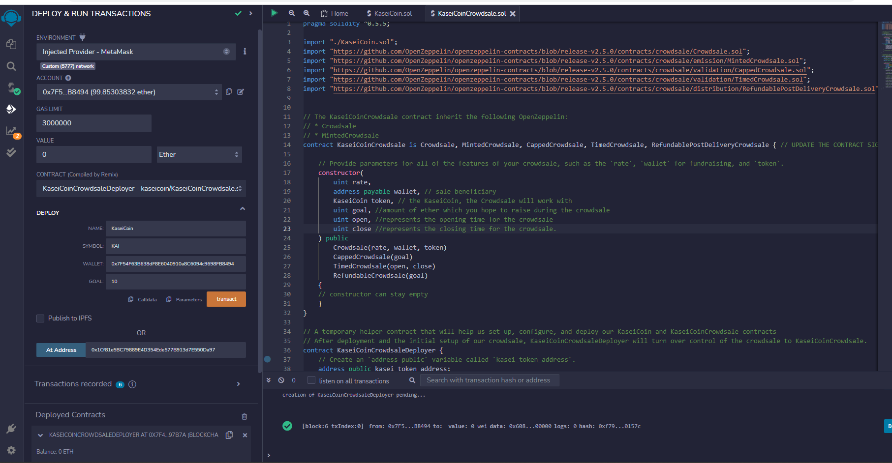
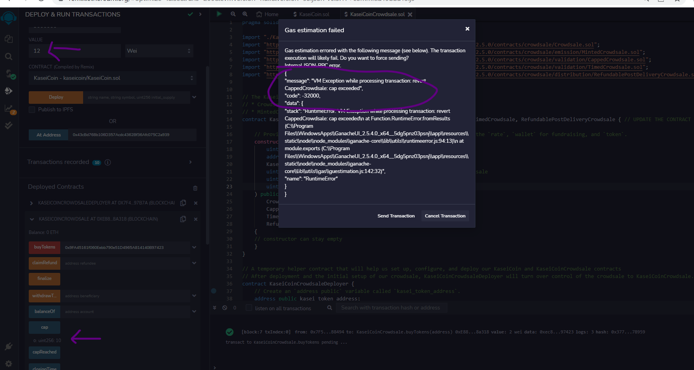

# Application

## Martian Token Crowdsale

KAI is a fungible token that is ERC-20 compliant and it will be minted by using a `Crowdsale` contract from the OpenZeppelin Solidity library.

The crowdsale contract will manage the entire crowdsale process, allowing users to send ether to the contract and in return receive KAI, or KaseiCoin tokens. Contract will mint the tokens automatically and distribute them to buyers in one transaction.

### Goal

The steps for this Challenge are divided into the following sections:

1. Create the KaseiCoin Token Contract

2. Create the KaseiCoin Crowdsale Contract

3. Create the KaseiCoin Deployer Contract

4. Deploy the Crowdsale to a Local Blockchain

5. Extend the Crowdsale Contract by Using OpenZeppelin

### Technology

* Remix IDE for smart contract creation
* MetaMask + Ganache used as local blockchain

#### Evaluation Evidence

> Compile KaseiCoin contract

> Compile CrowdSale and Deployer contracts

> Deployment of Deployer (Input name, symbol and wallet address deatils)

> Link deployer to KaseiCoinCrowdSale contract using the address for CrowdSale from deployer

> Link deployer to KaseiCoin contract using the address for token from deployer

> Buy KaseiCoins worth 3 ETH

> Buy KaseiCoins worth 1 ETH

> Check balance for recent transaction and address

> Following are all the transactions (seen in ganache)

> Check total supply

##### Optional Exercise:
> Added inheritance to CrowdSale contract of Capped, Timed and Refundable-Post-Delivery Crowdsale.
> Deployed new contracts (with cap of 10 wei).

> And tested for purcahse of 12 tokens. Result is as follows:

---
## Installation Guide 

> Compile the contracts in Remix

> Open Ganache, connect it to MetaMask

> In Remix - deployment - Environment section, choose 'Injected Provider MetaMask'. Make the connection with MetaMask

> Select the address that you would like to use for deployment. Enter input paramters (Coin name, symbol and wallet address) and hit the transact/deploy button.

> Deployer contract will provide Crowdsale address and token address. Use them to link to Crowdsale contract and Token contract.
---
## Usage

> In remix - deployment section, user can go to KaseiCoinCrowdSale contract and invoke buyToken function (input address for which you would like to purchase tokens and also input number of wei/ether you would like to transact with). 

> In same section, user can go to KaseiCoin contract to check balance for the user and total supply

---
## Contributors

Main author is : Pravin Patil. His linkedin profile is [Profile](https://www.linkedin.com/in/pravin-patil-5880301)

---

## License

Open